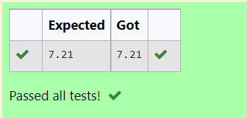

# DISTANCE-BETWEEN-TWO-POINTS

## AIM:
To write a python program to find the distance two 2 points
## ALGORITHM:
### Step 1: 
Import numpy module to use built-in functions
### Step 2: 
Get lists from the linear equations and assign it to np.array
### Step 3: 
Substitute the values in the distance formula  
### Step 4: 
Print the output
### Step 5: 
End the program
### PROGRAM:
#Program to find the distance between two points.
#Developed by: ishwarya.v
#RegisterNumber:21002894
import math
x=[10,6]
y=[4,2]
val=math.sqrt(((x[0]-y[0])*2)+((x[1]-y[1])*2))
print('{:.2f}'.format(val))

  

### OUTPUT:

### RESULT:
Thus,the distance two 2 points is obtained
